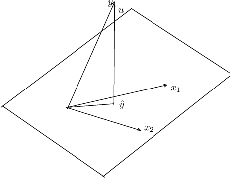

# OLS

A linear model with $n$ observations and $k$ regressors can be
written as (in vector forms)
$$ {\symbf{y=X\beta+u }}$$ {#eq-ols-1}

The idea of  least-squares is to choose $\beta$ to minimize the
residual sum of squares ($SSR$),

$$ SSR(\beta)  =  {\symbf{(y-X\beta)'(y-X\beta) =  y'y-2\beta'X'y+\beta'X'X\beta }}$$ {#eq-ols-2}

The first-order condition to minimize $SSR$ are:
$$ \frac{\partial (SSR)}{\partial \beta} = {\symbf{-2X'y+2X'X\beta=0}}$$ {#eq-ols-3}

This generates the so-called normal equations
$${\symbf{(X'X)\beta=X'y}}$$ {#eq-ols-4}

Therefore, Ordinary Least Squares (OLS) estimator of $\beta$ is
$${\symbf{\hat \beta=(X'X)^{-1}X'y}}$$ {#eq-ols-5}

## Fitness of OLS

We can see $y$ vector as the part explained by the regression
and the unexplained (residual) part,
$$ {\symbf{y=\hat y+\hat u=X\hat\beta+\hat u}}$$ {#eq-ols-6}
where $\hat u$ is the OLS residual. Because the residual is orthogonal to the
fitted values, ${\symbf{\hat y' \hat u=0}}$, so the cross term drops:
$${\symbf{y'y=(\hat y+\hat u)'(\hat y +\hat u)=\hat y' \hat y +\hat u'\hat u=\hat\beta'X'X\hat\beta +\hat u'\hat u }}$$ {#eq-ols-7}

Subtracting $n\bar y^2$ ($\bar y$ is the sample mean) from both
sides, **and assuming the regression includes an intercept** (so that
$\bar{\hat y}=\bar y$ and the residuals sum to zero, which is what
makes this centered decomposition and the $R^2$ interpretation below
hold),
$$ {\symbf{y'y-n\bar y^2=(\hat\beta'X'X\hat\beta-n\bar y^2) +\hat u'\hat u }}$$ {#eq-ols-8}


We decompose the total sum of squares into two parts:  sum of
squares due to error (noise), and sum of squares explained by the
linear regression.

The $R^2$ is defined by
$$R^2=1-\frac{SSR}{SST}$$ {#eq-ols-9}

$SST$ is the total (centered) sum of squares of $y$, ${\symbf{y'y-n\bar y^2 = \sum_t (y_t-\bar y)^2}}$.

$R^2$ is simply the proportion of the variation of $Y$ that can be
attributed to the variation of $X$.  $R^2$, however, will never
decrease with the addition of any variable to the set of
regressors.  $R^2$ stays exactly the same only in the knife-edge case
that the added variable is orthogonal to the current residuals; in
practice it always rises a little, even for an irrelevant variable.
The adjusted $R^2$, however, takes
account of the addition of any new regressors:

$$\bar R^2=1-\frac{SSR/(n-k)}{SST/(n-1)}$$ {#eq-ols-10}

## Example
Let's look at an example of OLS of car's mpg on disp, hp and wt.
```{r}
lm1 <- lm(mpg~disp+hp+wt, data=mtcars)
summary(lm1)
```

## The Geometry of Least Squares



For simplicity, let's assume there are two explanatory
variables $x_1$ and $x_2$. $x_1$ and $x_2$ form a plane.  What OLS
does is to project $y$ onto this plane.

In mathematical terms, all linear combinations of these two
vectors define a two-dimensional subspace of Euclidean space ${{\symbf{E}}}^n$.  This is called the column space of ${\symbf{X}}$.  The least-square
principle is to choose $\beta$ to make $\hat y$, which belongs to the
subspace of ${\symbf{X}}$, as close as possible to $y$.

When we estimate a linear regression model, we map the $y$ into a vector of fitted values ${\symbf{X \hat \beta}}$ and a vector of residuals ${\symbf{\hat u =y-X \hat \beta}}$.  Geometrically, these are examples of orthogonal projections.  A projection is a mapping that takes each point of ${{\symbf{E}}}^n$ into a point in a subspace of ${{\symbf{E}}}^n$.  An orthogonal projection maps any point into the point of the subspace that is closest to it.

An orthogonal projection  can be performed by premultiplying the vector to be projected by a projection matrix.  In the case of OLS, the two projection matrices that yield the vector of fitted values and the vector of residuals, are $${\symbf{P_X = X(X'X)^{-1}X' }}$$ {#eq-ols-11} $${\symbf{M_X = I-P_X = I- X(X'X)^{-1}X'}}$$ {#eq-ols-12}

From this, we see that the effects of two projection matrices.
$${\symbf{P_X y  =  X \hat \beta =\hat y  }}$$ {#eq-ols-13}
$${\symbf{M_X y  =  (I-P_X)y = y- P_X y = y-X \hat \beta =\hat u }}$$ {#eq-ols-14}

That is, ${\symbf{P_X y}}$ projects ${\symbf{y}}$ onto ${\symbf{X}}$ and makes it ${\symbf{\hat y}}$; ${\symbf{M_X y}}$ makes it ${\symbf{\hat u}}$.

In the picture, that corresponds to the fact that the projection of ${\symbf{y}}$ onto the plane of ${\symbf{X}}$ creates two parts:  ${\symbf{\hat y}}$ and ${\symbf{\hat u}}$.


## OLS as Conditional Expectation

The derivation above shows how to compute ${\symbf{\hat\beta}}$ from a
sample.  We now ask a different question: what does OLS estimate at
the population level?

### The Conditional Expectation Function

For a random pair $(Y, X)$, the conditional expectation function
(CEF) is $E[Y \mid X]$, a function of $X$ alone.  Any random
variable $Y$ can be decomposed as
$$Y = E[Y \mid X] + \varepsilon, \qquad E[\varepsilon \mid X] = 0.$$ {#eq-cef-decomp}

This is not an assumption; it is a definition.  The residual
$\varepsilon = Y - E[Y \mid X]$ is mean-independent of $X$ by the
construction of conditional expectation.

The CEF has an optimality property: among all functions $g(X)$,
$E[Y \mid X]$ minimizes the mean squared prediction error,
$$E[Y \mid X] = \arg\min_{g}\; E\bigl[(Y - g(X))^2\bigr].$$ {#eq-cef-mmse}

That is, if we could use any function of $X$ to predict $Y$, the
CEF would be the best predictor in the mean squared error sense.
The proof follows from the decomposition above: for any $g$,
$$E\bigl[(Y-g(X))^2\bigr]
= E\bigl[(Y - E[Y\mid X])^2\bigr]
+ E\bigl[(E[Y\mid X] - g(X))^2\bigr]
+ 2\,E\bigl[\varepsilon\,(E[Y\mid X]-g(X))\bigr].$$ {#eq-cef-proof-expand}

The cross term vanishes by iterated expectations: $E[Y\mid X]-g(X)$
is a function of $X$, so
$E\bigl[\varepsilon\,(E[Y\mid X]-g(X))\bigr]
= E\bigl[E[\varepsilon\mid X]\,(E[Y\mid X]-g(X))\bigr] = 0$.
The first term does not depend on $g$, and the second is
nonnegative and equals zero when $g = E[Y\mid X]$.

### The Best Linear Predictor

In practice we rarely know the CEF, and we often restrict attention
to linear predictors.  The best linear predictor (BLP) of $Y$ given
$X$ is the coefficient vector $\beta$ that solves
$$\beta = \arg\min_{b}\; E\bigl[(Y - X'b)^2\bigr].$$ {#eq-blp-def}

Taking the first-order condition,
$$\frac{\partial}{\partial b}\, E\bigl[(Y - X'b)^2\bigr]
= -2\, E\bigl[X(Y - X'b)\bigr] = 0,$$ {#eq-blp-foc}

which gives the population normal equation
$$E[XX']\,\beta = E[XY].$$ {#eq-blp-normal}

If $E[XX']$ is nonsingular, the BLP coefficient is
$$\beta = \bigl(E[XX']\bigr)^{-1}\, E[XY].$$ {#eq-blp-coef}

This is the population analog of the sample formula
${\symbf{\hat\beta = (X'X)^{-1}X'y}}$.  The population version
replaces sample cross-products with their expectations.

The first-order condition can equivalently be written as the
population orthogonality condition:
$$E\bigl[X(Y - X'\beta)\bigr] = 0.$$ {#eq-blp-orth}

This says that the linear prediction error $Y - X'\beta$ is
uncorrelated with every component of $X$.  It is the population
version of the sample condition ${\symbf{X'\hat u = 0}}$ that we
derived from the matrix normal equations.

### The BLP Approximates the CEF

The BLP and the CEF are connected by a key result: the BLP is the
best linear approximation to the CEF.  To see this, write
$$\beta = \bigl(E[XX']\bigr)^{-1}\, E[XY]
= \bigl(E[XX']\bigr)^{-1}\, E\bigl[X\, E[Y \mid X]\bigr],$$ {#eq-blp-cef}

where the second equality uses the law of iterated expectations.
The BLP coefficient depends on $Y$ only through the CEF.  OLS is
fitting a linear function to the CEF, not directly to $Y$.

When the CEF is linear in $X$ — that is, $E[Y \mid X] = X'\beta$
for some $\beta$ — the BLP recovers the CEF exactly.  The linear
model is correctly specified and OLS estimates the true conditional
expectation.

When the CEF is nonlinear, the BLP still provides the minimum mean
squared error linear approximation to it.  The OLS coefficient
retains a well-defined interpretation: it is the slope of the best
linear predictor, even if the world is nonlinear.  This is why OLS
remains useful in settings where the true CEF is unknown and
possibly complicated.

### From Population to Sample

The population formulas become sample formulas when we replace
expectations with sample averages.  For a sample of $n$
observations,
$$E[XX'] \approx \frac{1}{n} \sum_{i=1}^n X_i X_i'
= \frac{1}{n}\, {\symbf{X'X}}$$ {#eq-pop-sample-xx}

$$E[XY] \approx \frac{1}{n} \sum_{i=1}^n X_i Y_i
= \frac{1}{n}\, {\symbf{X'y}}$$ {#eq-pop-sample-xy}

Substituting into the population BLP formula gives
$${\symbf{\hat\beta}}
= \left(\frac{1}{n}\,{\symbf{X'X}}\right)^{-1}
  \frac{1}{n}\,{\symbf{X'y}}
= {\symbf{(X'X)^{-1}X'y}},$$ {#eq-sample-ols-from-pop}

which is the OLS estimator derived from the matrix normal equations.
The $1/n$ factors cancel.  This shows what OLS does: it uses sample
analogs to estimate the population BLP, which is the best linear
approximation to the conditional expectation function $E[Y \mid X]$.


## Properties of OLS estimator

### Unbiasedness
In a linear model
$$
{\symbf{y=X\beta+u,
}}$$ {#eq-ols-15}
 the OLS estimator is
$$
{\symbf{\hat \beta=(X'X)^{-1}X'y
}}$$ {#eq-ols-16}

Since ${\symbf{y=X \beta+u}}$,

$$
{\symbf{\hat \beta=\beta + (X'X)^{-1}X'u.
}}$$ {#eq-ols-17}

This makes
$$
{{\mathrm{E}}} {\symbf{(\hat \beta | X)=\beta + (X'X)^{-1}X'{E} (u|X).
}}$$ {#eq-ols-18}

The condition that makes the OLS estimator unbiased is:
$$
{{\mathrm{E}}} {\symbf{(u|X)=0,
}}$$ {#eq-ols-19}

that is, all explanatory variables which form the columns of ${\symbf{X}}$
are exogenous.  This condition is weaker than the independence
condition that $u$ and $X$ are independent. This says that given ${\symbf{X}}$, the expected value of ${\symbf{u}}$ is zero; it implies that the model
is correctly specified.  That is, ${\symbf{y}}$ is a linear function of ${\symbf{X}}$.

In the context of cross-sectional data, this assumption is plausible.
However, when we have time series data, the assumption becomes strong,
because it assumes that the entire series of ${\symbf{X}}$ has no
relationship with the error term.  In a time series context, this is
hard to satisfy.  The OLS estimator is biased if this condition
is not satisfied.

For example, suppose we have a model

$$ y_t = \beta_1 + \beta_2 y_{t-1} + u_t, \quad u_t \sim {{\mathrm{IID}}} (0, \sigma^2). $$ {#eq-ols-20}

In this simple model, even if we assume that $y_{t-1}$ and $u_t$ are
uncorrelated, OLS estimator is still biased.  That is because
${{\mathrm{E}}} {\symbf{(u|X)=0}}$
is not satisfied: $y_{t-1}$ depends on $u_{t-1}$,
$u_{t-2}$ and so on.


There is a weaker condition -- weaker than the strict exogeneity above, and in fact
the weakest of the conditions in this chapter:
$$
{{\mathrm{E}}} {\symbf{(X u)=0,
}}$$ {#eq-ols-21}

Once we know that the model is correctly specified, then this equation can be used to derive results, such as GMM estimators.

### Consistency

For OLS estimator to be consistent, a much weaker condition is needed:
$$
{{\mathrm{E}}} (u_t|X_t)=0,
$$ {#eq-ols-22}

This condition is much weaker since it only assumes that the mean of current error term does not depend on the current predictors.  Even a model with lagged dependent variable can easily satisfy this condition.  This condition is called **contemporaneous exogeneity**.  It is the weakest of
three exogeneity conditions worth keeping apart, which is precisely why it is the
one to invoke for consistency:

- **Strict exogeneity**, $E[u_t \mid X_1, \dots, X_n]=0$: the error in every
  period is mean-independent of the regressors in *every* period.  This is what
  unbiasedness requires, and what the lagged-dependent-variable example above
  violates.
- **Predeterminedness**, $E[u_t \mid \mathcal F_{t-1}]=0$ with $X_t$ measurable
  with respect to $\mathcal F_{t-1}$ -- equivalently, $X_t$ is orthogonal to the
  current and all *future* errors, while being allowed to correlate with *past*
  errors.  This is the relevant condition in models with a lagged dependent
  variable.
- **Contemporaneous exogeneity**, $E[u_t \mid X_t]=0$.
- **Contemporaneous orthogonality**, $E[X_t u_t]=0$ -- mere zero correlation. This
  is weakest of all, and it is what consistency actually needs: together with a
  rank condition and a law of large numbers it gives
  $\mathrm{plim}\, n^{-1}{\symbf{X'u = 0}}$ and hence
  $\mathrm{plim}\, \hat\beta = \beta$. Contemporaneous *exogeneity* is a
  strictly stronger, sufficient condition -- it constrains the whole conditional
  mean rather than a single covariance -- so the $E[{\symbf{Xu]=0}}$ introduced under
  unbiasedness above sits at the *bottom* of this ladder, not between the others.

Each condition implies the next, because conditioning on a larger information set
is a more restrictive requirement, not a less restrictive one.  In particular, by
the law of iterated expectations,
$$
E[u_t \mid X_t] = E \bigl[ E[u_t \mid \mathcal F_{t-1}] \;\big|\; X_t \bigr] = 0,
$$ {#eq-ols-23}
so predeterminedness delivers contemporaneous exogeneity but not conversely.  In
the time series example, then, the OLS estimator is biased, but can still be
consistent, if we are willing to assume no contemporaneous correlation.

Note: general linear hypothesis testing, the Chow test for structural change, and heteroskedasticity- and autocorrelation-consistent (HAC) standard errors (White, Newey-West) are all standard OLS extensions, but are covered in the [Maximum Likelihood chapter](mle.qmd) alongside this guide's other estimation-inference material rather than repeated here.
