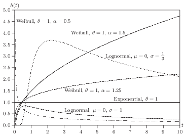

# Survival Models

```{r}
#| include: false
library(ggfortify)
library(survival)
```

## Survival function


Survival analysis is also called time to event analysis or event
history analysis.  We use survival models to analyze data that have the following characteristics:

1. the dependent variable is the waiting time till the occurrence of some event;
2. some observations are censored; that is, some units are not in the data set anymore for some reason before an event happens.  For some units we observe the event and the exact waiting time; for others it has not occurred, and all we know is that the waiting time exceeds the observation time.  However, we believe if they stayed in the study, sooner or later an event would happen.
3.  we are trying to explain (predict) the occurrence of an event with some predictors (explanatory variables).

Censoring is what makes this its own subject, and it carries an assumption that
belongs before any estimator.  Kaplan-Meier and the Cox partial likelihood below
both require censoring to be **independent**, or noninformative: conditional on the
covariates in the model, units censored at a given time must be neither more nor
less likely to experience the event than comparable units still under observation.
Put plainly, being censored may not carry information about when the event would
have happened.

This is an identification assumption, not a technical footnote.  It fails whenever
units leave for reasons tied to the outcome -- patients withdrawing because they are
deteriorating, firms vanishing from a sample shortly before they fail, workers
leaving a spell study just as re-employment arrives.  Nothing in the data announces
the failure and no sample size repairs it.  The usual response is to bring the
relevant variables into the model, since the assumption is conditional on
covariates, and then to argue explicitly why the censoring that remains is
unrelated to the event process.


Let $T$ denote the time variable, a nonnegative, continuous
random variable with PDF $f(t)$ and CDF $F(t)$, where $t$ is a
realization of $T$.  The survival function is defined by

$$
S(t) = Pr(T>t) = 1-F(t)
$$ {#eq-survival-1}

The graph of $S(t)$ against $t$ is known as the survival curve.  If
there is no censoring, then the survival function is easy to estimate
by the ratio of the number of units surviving beyond $t$ to the total
number of units in the sample.  The most common method to estimate the survival
function with a survival data set containing censored observations is
the Kaplan-Meier method.  The basic idea is to use the product of a series of conditional probabilities.

First sort the event times from the smallest to the largest:


$$
t_{(1)} \le t_{(2)} \le ... \le t_{(r)}
$$ {#eq-survival-2}


Then the survival curve is estimated by:

$$
\hat S(t) = \prod_{j | t_{(j)} \le t} (1-\frac{d_j}{r_j}),
$$ {#eq-survival-3}

where $r_j$ is the number of units at risk at $t_{(j)}$ and $d_j$ is
the number of "failure" or events at $t_{(j)}$.  Note that units
censored at $t_{(j)}$ are included in $r_j$.

The variance of this estimator can be estimated by:

$$
\hat {var} (S(t)) = (\hat S(t))^2 \sum_{j | t_{(j)} \le t} \frac{d_j}{r_j(r_j-d_j)}.
$$ {#eq-survival-4}


## Hazard function

We are often interested in which periods have the highest or lowest
change of "death" or "failure" or other events.  That is, we may
be interested in the probability that a state ends between $t$ and $t+
\Delta t$ conditional on having reached $t$ in the first place.

The probability is
$$
\mbox{Pr} (t<T \leq t+\Delta t | T \geq t)=\frac{F(t+\Delta
t)-F(t)}{S(t)}
$$ {#eq-survival-5}

The hazard function is defined by
$$
h(t)=\lim_{\Delta t \rightarrow 0}\frac{\mbox{Pr} (t<T \leq t+\Delta t |
T \geq t)}{\Delta t}=\frac{f(t)}{S(t)}=\frac{f(t)}{1-F(t)}
$$ {#eq-survival-6}

One of the simplest functional forms is the exponential
distribution
$$
f(t,\theta)=\theta e^{-\theta t}
$$ {#eq-survival-7}

Therefore, the hazard function is
$$
h(t)=\theta
$$ {#eq-survival-8}

A much more flexible functional form is Weibull, with CDF, survival, and density
$$
F(t,\theta, \alpha)=1-\exp(-(\theta t)^{\alpha}), \quad S(t)=\exp(-(\theta t)^{\alpha}), \quad f(t)=\alpha \theta^{\alpha} t^{\alpha-1}\exp(-(\theta t)^{\alpha}).
$$ {#eq-survival-9}

Hazard function can be shown to be
$$
h(t)=\alpha \theta^{\alpha} t^{\alpha-1}
$$ {#eq-survival-10}

However, Weibull distribution does not allow for the possibility
that the hazard may first increase then decrease over time.
Log-normal distribution does allow this.

{fig-alt="Six hazard functions h(t) plotted against time t from 0 to 10. The exponential hazard is flat at one. Weibull with shape below one falls steeply from a high value; Weibull with shape above one rises monotonically. A lognormal with small sigma rises to a peak near t equals two and then declines, illustrating a non-monotone hazard; a lognormal with sigma one stays low throughout. Together they show constant, increasing, decreasing and hump-shaped hazard shapes."}

## Log-likelihood function

Suppose we have $n$ units with a survival function $S(t)$, density $f(t)$, and hazard $h(t)$.
If for unit $i$, the event happens at $t_i$, it's contribution to the likelihood function is the density at that point:

$$
L_i=f(t_i)=S(t_i)h(t_i)
$$ {#eq-survival-11}


If no event at $t_i$, all we know is that the lifetime exceeds $t_i$.  The probability is
$$
L_i=S(t_i),
$$ {#eq-survival-12}
which is the contribution to the likelihood function from a censored
observation.

Therefore, if $U$ denotes the set of uncensored observations, the
log-likelihood function for the entire sample can be written as
$$
\ell (t, \theta)=\sum_{i \in U} \log h(t_i | {{\symbf{X}}}_i,
\theta)+\sum_{i=1}^n \log S(t_i | {{\symbf{X}}}_i, \theta)
$$ {#eq-survival-13}

## Proportional Hazard Models

### Model and likelihood

One class of models that is quite widely used is the proportional
hazard models (based on Cox (1972)).
$$
h(t | {{\symbf{x}}}_i)=h_0(t)\exp ({{\symbf{x}}}'_i \beta),
$$ {#eq-survival-14}

In this model $h_0(t)$ is called baseline hazard rate; it describes
the risk for units with ${\symbf{x_i = 0}}$. $\exp ({{\symbf{x}}}'_i \beta)$
represents the relative risk, a proportionate increase or decrease in
risk, due to ${\symbf{x_i}}$.  The interpretation of $\beta$ is that
$\exp(\beta_i)$ gives the relative risk change associated with an
increase of one unit in $x_i$, all other explanatory variables remaining
constant.

$\beta$ is estimated by maximizing a partial likelihood function.  It
is partial likelihood function since the baseline hazard is factored
out.  Suppose one event happens at time $t_j$.  Conditional on this
event the probability that case $i$ dies (meaning this event happened
to case $i$, not other cases in the risk set) is


$$
L_i=\frac{h_0(t_j) \exp(x_i' \beta)} {\sum_l I(T_l \ge t_j) h_0(t_j) \exp(x_l' \beta)}=\frac{ \exp(x_i' \beta)} {\sum_l I(T_l \ge t_j)  \exp(x_l' \beta)}
$$ {#eq-survival-15}

We can see here that Cox's model is for continuous time survival data.
It is assumed there is no ties at time $t_j$ (in continuous time is
not possible for two events to happen at the same time).  In reality,
we observe ties of event time, because in many situations, we observe
grouped data.  For example, we observe case $m$ and $n$ have events at
the same time $j$.  In that case, in the denominator, whether we include
case $m$ in the calculation of the likelihood of case $n$ is
ambiguous.  In that case, special treatment is needed.  The standard
approximation here is Breslow's:

$$
L_{m \in D(t_j)} \simeq \frac{ \prod_{m \in D(t_j)} \exp(x_m' \beta)} {[\sum_{l \in R(t_j)} \exp(x_l' \beta)]^{d_j}}
$$ {#eq-survival-16}

where $D(t_j)$ is the set of cases that die at time $t_j$ and $d_j$
denotes the number of cases that die at time $t_j$.  This
approximation works well with small number of ties relative to total
number of cases at risk.  Peto's approximation is a close relative of it.  Efron's
is a finer adjustment that apportions the risk set among the tied cases, and it is
the more accurate of the two when ties are common.  The defaults differ by
software: R's `coxph` uses Efron, Stata's `stcox` uses Breslow, so the same data
can produce slightly different coefficients in the two without either being
wrong.


One important feature (disadvantage?) for the proportional hazard
model is that for all units, the effect is the same at all time $t$.
To see this:

$$
\frac{h_1(t)}{h_2(t)} = \frac{h_0(t)\exp ({{\symbf{x}}}_1' \beta)}{h_0(t)\exp ({{\symbf{x}}}_2' \beta)}= \frac{\exp ({{\symbf{x}}}_1' \beta)}{\exp ({{\symbf{x}}}_2' \beta)},
$$ {#eq-survival-17}
which does not depend on $t$.

One advantage of Cox's model is that it is considered as a
semi-parametric model since it does not have to specify the
distribution of the survival time.  The estimation process relies only
on the order in which events occur, not on the spacing between them.  The exact
times still matter, because they are what determines who sits in each risk set.
What drops out is the baseline hazard, and with it any need to model how far apart
the events are.
Parameter estimates are derived assuming continuous survival times.

### Interpretation

In the equation above, if we would like to calculate the partial effect of $x_j$ on $h$, we have:

$$
\partial h(t | {{\symbf{x}}}_i) / \partial x_j=h_0(t)\exp ({{\symbf{x}}}'_i \beta) \beta_j = \beta_j h(t | {{\symbf{x}}}_i),
$$ {#eq-survival-18}

If we do it the other way, plug in $x_j + 1$ will generate

$$
h_0(t)\exp ({{\symbf{x}}}'_i \beta + \beta_j) = \exp (\beta_j) h(t|{{\symbf{x}}}_i)
$$ {#eq-survival-19}


Therefore, a one unit change in $x_j$ multiplies the hazard by $\exp(\beta_j)$ (a proportionate change of $\exp(\beta_j)-1$).

### Example in R

```{r}

library(ggfortify)
library(survival)
fit <- survfit(Surv(time, status) ~ sex, data = lung)
autoplot(fit)

```
Censored observations are denoted by crosses.  This is the so-called Kaplan-Meier curve.

Now let's do a Cox model example.

```{r}

fit2 <- coxph(Surv(time, status) ~ sex + age, data = lung, method="breslow")
summary(fit2)

```

Examples of parametric survival models: exponential, Weibull, or log-logistic:

```{r}

exp_fit <-  survreg(Surv(time, status) ~ sex + age, data = lung, dist="exponential")
summary(exp_fit)
weibull <-  survreg(Surv(time, status) ~ sex + age, data = lung, dist="weibull")
summary(weibull)
loglog <-  survreg(Surv(time, status) ~ sex + age, data = lung, dist="loglogistic")
summary(loglog)

```

One caveat when reading these next to the Cox fit above.  `survreg` estimates
*accelerated failure time* models, parameterized on log survival time, whereas
`coxph` estimates proportional hazards.  The coefficients therefore carry
*opposite* signs for the same underlying effect: a covariate that raises the
hazard shortens expected survival time.  A sign flip between the two tables is
the expected result of the differing parameterizations, not a contradiction.

Expect the reversal of direction; do not expect mirror-image magnitudes.
Exponential and Weibull are the families that are both PH and AFT, and there the
two parameterizations are related exactly through the shape parameter, so the AFT
coefficient scaled by the shape recovers the PH coefficient up to sign.
Log-logistic, the third fit above, is an AFT family that is *not* proportional
hazards at all, so it has no PH coefficient to be the mirror of.  Setting a
log-logistic fit beside a Cox fit compares two different models of the same data,
and only the direction of the effect should be expected to agree.


## Discrete-time Survival Models

Cox (1972) is the *continuous-time* proportional hazards model; the
discrete-time analogue models the odds of an event at time $t_j$ given
survival up to that point.  This proportional-odds specification for
the discrete hazard,

$$
\frac{h(t_j | {{\symbf{x}}}_i)}{1- h(t_j | {{\symbf{x}}}_i)} = \frac{h_0(t_j)}{1- h_0(t_j)} \exp({{\symbf{x}}}'_i \beta),
$$ {#eq-survival-20}
is a discrete-time *proportional-odds* hazard model rather than a
direct discretization of Cox's continuous-time proportional hazards
model.  (The complementary log-log link is the discrete-time form that
corresponds more directly to a grouped continuous-time proportional
hazards model.)  If we take logs on both sides, we have

$$
{{\mathrm{logit}}} (h(t_j | {{\symbf{x}}}_i)) = \alpha_j +  {{\symbf{x}}}'_i \beta,
$$ {#eq-survival-21}
This looks very similar to a logit model.  In fact, we can fit a
discrete-time proportional hazard model by running a logistic
regression on a set of pseudo observations generated by "filling in"
the observations between the start time to the event time or time at
the end of the study period (censored).  The outcome of this process
is 0 unless there is an event, then it turns 1.  It is treated as
independent Bernoulli observations with probability given by hazard
$h_{ij}$ for individual $i$ at time $t_j$.  The likelihood function
for the discrete-time survival model coincides with the likelihood of a
sequence of independent Bernoulli trials (Singer and Willett, 1993, has more details).


### Do it in Stata

To do a discrete-time survival model in Stata, your data set needs to
be set up as by unit-time.  For example, observations by company
month.  The event (or failure) variable needs to be set to zero until
the event happens.  If no event until the end of the study period,
then it is censored.  A data set by unit-time can be analyzed by logit
model, optionally with clustered standard error.  To set up a
structure like this, user-written programs called $dthaz$ and
$prsnperd$ (means person-period) can be used.


To do a continuous-time survival model in Stata, your data can be
either set up as discrete-time case (in which case you can use a
time-varying explanatory variable) or a single-record-per-person data
set.  Stata has built-in command $stset$ to set up a survival analysis
structure.  Then you can run $stcox$ for Cox's proportional hazard
model.
